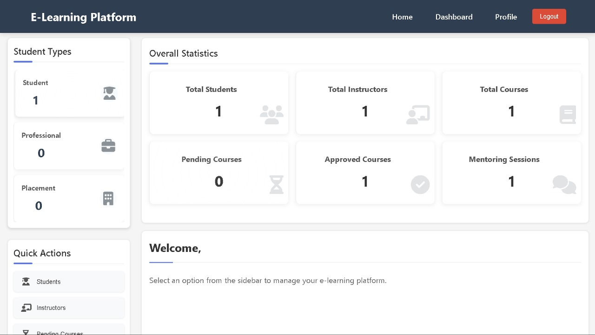
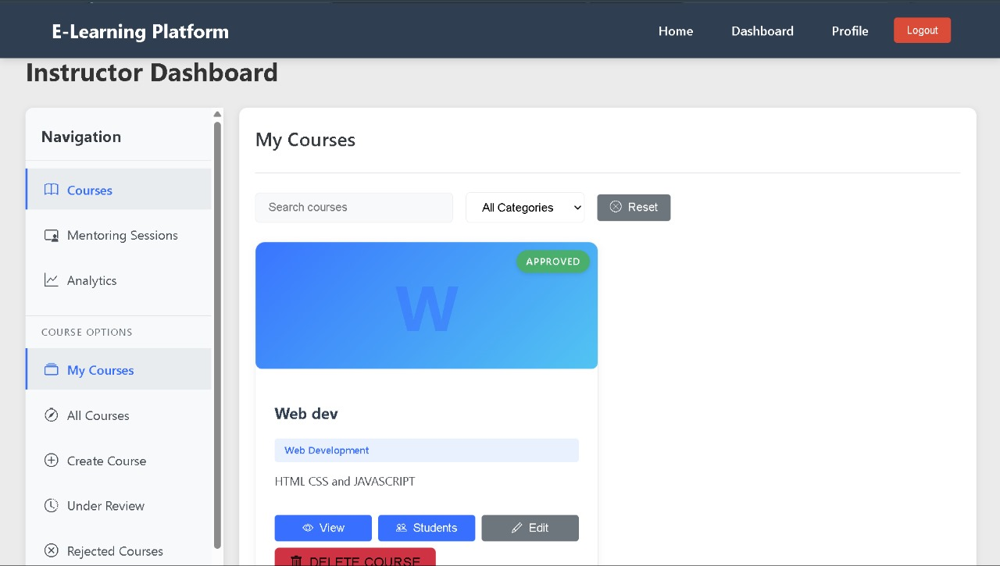
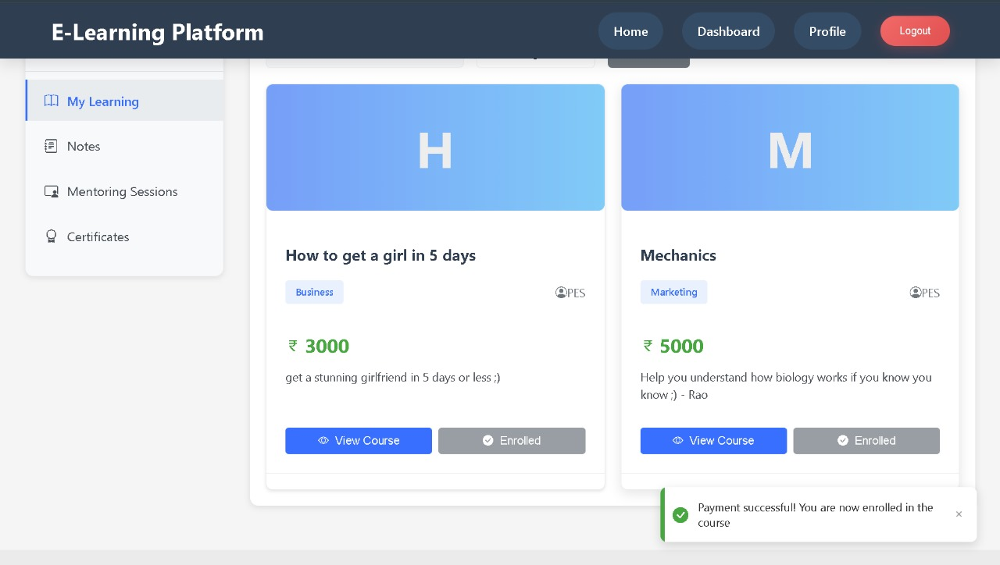

## Setup Instructions

### Prerequisites

- Java 17 or Java 21
- Maven
- Node.js and npm
- PostgreSQL

### Backend Setup

1. Create a PostgreSQL database:

   ```sql
   CREATE DATABASE elearning;
   ```

2. Configure database connection in `backend/src/main/resources/application.properties`:

   ```properties
   spring.datasource.url=jdbc:postgresql://localhost:5432/elearning
   spring.datasource.username=your_username
   spring.datasource.password=your_password
   ```

3. Navigate to the backend directory and build the project:
   ```bash
   cd backend
   mvn clean install
   ```

### Frontend Setup

1. Navigate to the frontend directory:

   ```bash
   cd frontend
   ```

2. Install dependencies:
   ```bash
   npm install
   ```

## Running the Application

### Running the Backend

1. From the backend directory:
   ```bash
   mvn spring-boot:run
   ```
   The backend will run on http://localhost:8080

### Running the Frontend

1. From the frontend directory:
   ```bash
   npm start
   ```
   The frontend will run on http://localhost:3000

## Features

### Currently Implemented

- **User Registration**: Create a new account with username, email, password, and full name
- **User Authentication**: Login with username and password, JWT token-based authentication
- **Home Page**: Landing page with platform information and features
- **Security**: Secured endpoints with role-based access control

### Planned Features

- Course creation and management
- Course enrollment
- Content upload and management
- Interactive learning features (quizzes, assignments)
- Discussion forums
- Progress tracking
- Certification generation

## API Endpoints

### Authentication

- `POST /api/auth/signup`: Register a new user

  ```json
  {
    "username": "user123",
    "email": "user@example.com",
    "password": "password123",
    "fullName": "John Doe"
  }
  ```

- `POST /api/auth/signin`: Login
  ```json
  {
    "username": "user123",
    "password": "password123"
  }
  ```

### Test Endpoints

- `GET /hello`: Simple test endpoint that returns "Hello World!"
- `GET /endpoints`: Lists all available API endpoints (for debugging)

## Database Schema

### Users Table

| Column    | Type         | Description        |
| --------- | ------------ | ------------------ |
| id        | BIGINT       | Primary key        |
| username  | VARCHAR(255) | Unique username    |
| email     | VARCHAR(255) | Unique email       |
| password  | VARCHAR(255) | Encrypted password |
| full_name | VARCHAR(255) | User's full name   |
| enabled   | BOOLEAN      | Account status     |

### User_Roles Table

| Column  | Type         | Description                             |
| ------- | ------------ | --------------------------------------- |
| user_id | BIGINT       | Foreign key reference to Users table    |
| role    | VARCHAR(255) | Role (ROLE_STUDENT, ROLE_INSTRUCTOR...) |

## Troubleshooting

### Common Issues

1. **Database Connection Error**:

   - Verify PostgreSQL is running
   - Check database credentials in application.properties
   - Ensure the database exists

2. **Backend Not Starting**:

   - Check console for specific error messages
   - Verify port 8080 is not in use

3. **Frontend Not Starting**:

   - Verify Node.js is installed
   - Check for errors in the npm install process
   - Ensure port 3000 is not in use

4. **Authentication Issues**:

   - Verify JWT configuration
   - Check security filter chain configuration
   - Ensure correct endpoints are being permitted

5. **API Call Errors**:
   - Verify the correct URL is being used
   - Check that the Content-Type header is set to application/json
   - Ensure the request body follows the expected format

## Future Enhancements

1. **Course Management**:

   - Course creation and editing
   - Content organization
   - Enrollment management

2. **Learning Content**:

   - Video lectures
   - Interactive quizzes
   - Assignments

3. **User Interaction**:

   - Discussion forums
   - Live chat
   - Peer review

4. **Analytics**:

   - Learning progress tracking
   - Course analytics
   - Performance insights

5. **Mobile Support**:
   - Responsive design
   - Mobile app integration

## Screenshots

### Frontend Dashboards

- **Admin Dashboard**
  

- **Instructor Dashboard**
  

- **Student Dashboard**
  

---

Developed as part of a learning project by Mudar Pranav, Mohul Y P, M K Vishwaas, Manas Shetty. For questions or support, contact the development team.
